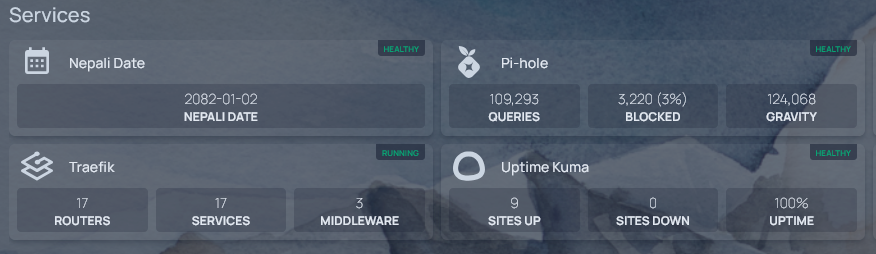

# 🇳🇵 Nepali Date API (Dockerized)

A minimal Flask API that returns today's Nepali date (`बिक्रम संवत`) using the [py-nepali](https://github.com/opensource-nepal/py-nepali) library.

The API is containerized using Docker and served via Gunicorn for production readiness.

---

## Features

- Get today’s Nepali date via `/date` endpoint
- Lightweight Alpine-based Docker image
- Production-ready with Gunicorn WSGI server
- Healthcheck endpoint for container monitoring

---

## Response

```json
{
  "nepali_date":"2082-01-02"
}
```

---

## Docker Usage

### Build the image locally
```
docker build -t nepali-date-api .
```
### Run the container
```
docker run -p 5000:5000 nepali-date-api
```
Visit: http://IP:5000/date

---

## Docker Compose (Recommended)
Create a `docker-compose.yml` file:
```
services:
  nepali-date:
    image: ghcr.io/shreead/nepali-date:latest
    container_name: nepali-date
    ports:
      - "5000:5000"
    restart: unless-stopped
```
Then run:
```
docker-compose up -d
```
Access the API at http://IP:5000/date

---

## Homepage integration

Display on [Homepage](https://gethomepage.dev) dashboard using their [custom API](https://gethomepage.dev/widgets/services/customapi/) by adding this to the `config/services.yaml` file:
```
- Services:
    - Nepali Date:
        container: nepali-date
        icon: mdi-calendar-month
        server: server-name # defined in docker.yaml file
        showStats: false
        widget:
          type: customapi
          url: 'http://IP:5000/date'
          refreshInterval: 50000
          method: GET
          mappings:
            - field: nepali_date
              label: Nepali Date
```

---

## Credits
[py-nepali](https://github.com/opensource-nepal/py-nepali) by [opensource-nepal](https://github.com/opensource-nepal)
